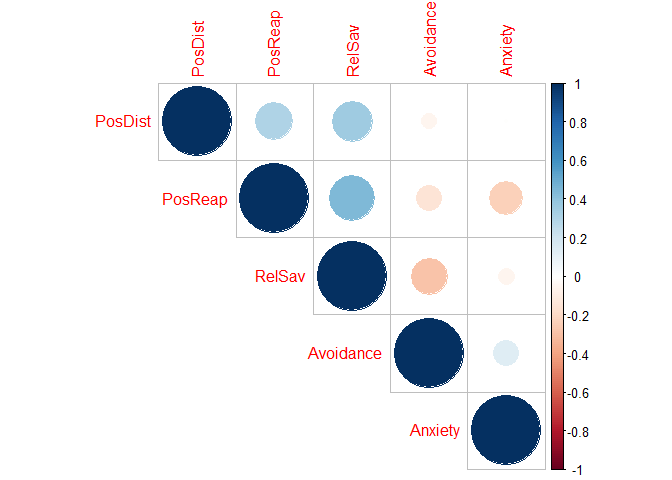
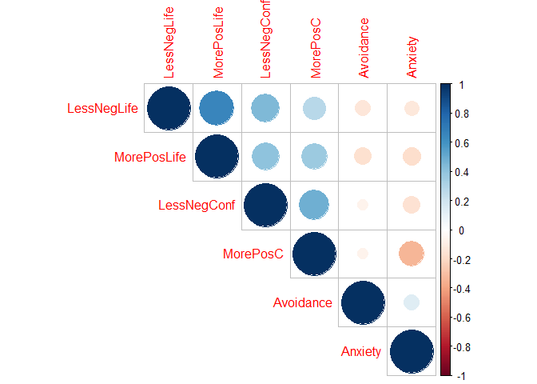
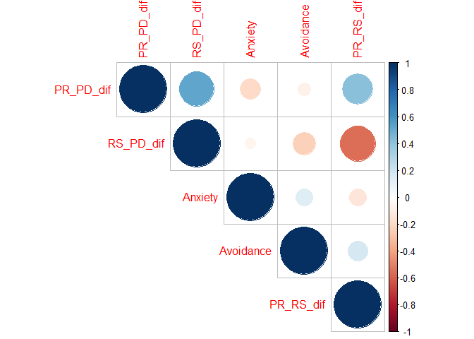

Thesis-Study-1
================
Fanyi Zeng
2022-05-05

In my study 1, I used attachment dimensions (attachment anxiety and
avoidance) to predict the choice of strategies to cope with typical
interpersonal conflicts in general close relationships (parent-children,
partners, friends).

After correcting for p values, anxiety was significantly, negatively
correlated with positive reappraisal, and avoidance was significantly,
negatively correlated with relational savoring. All three strategies
were significantly, positively correlated with one another.

To cope with interpersonal stress, more anxiously attached individuals
are less likely to use positive reappraisal, i.e., to change their
perspectives of a stressor from negative to positive. More avoidantly
attached individuals are less likely to use relational savoring, i.e.,
to reflect on pleasant memories of the relationship to feel more secure.

People who are likely to use one strategy are also likely to use other
strategies. Less avoidantly attached individuals are more likely to use
relational savoring, as well as the other two strategies. Less anxiously
attached individuals are more likely to use positive reappraisal, as
well as the other two strategies. As such, more securely attached
individuals are more likely to be open to using all three strategies.

``` r
cor1<-rcorr(as.matrix(Study1[,c(44:48)]))
corrplot(cor1$r, type="upper", order="hclust", 
         p.mat = cor1$p, sig.level = 0.05, insig = "blank")
```

<!-- -->

The above relationships between one attachment dimension and strategy
use held when controlling for the other dimension.

``` r
m1 <- lm(PosReap ~ Anxiety + Avoidance, Study1)
summary(m1)
```

    ## 
    ## Call:
    ## lm(formula = PosReap ~ Anxiety + Avoidance, data = Study1)
    ## 
    ## Residuals:
    ##      Min       1Q   Median       3Q      Max 
    ## -1.63894 -0.49487 -0.04712  0.46025  1.67012 
    ## 
    ## Coefficients:
    ##             Estimate Std. Error t value Pr(>|t|)    
    ## (Intercept)  3.20829    0.22789  14.079  < 2e-16 ***
    ## Anxiety     -0.09210    0.03446  -2.673  0.00841 ** 
    ## Avoidance   -0.07083    0.05028  -1.409  0.16109    
    ## ---
    ## Signif. codes:  0 '***' 0.001 '**' 0.01 '*' 0.05 '.' 0.1 ' ' 1
    ## 
    ## Residual standard error: 0.6838 on 142 degrees of freedom
    ## Multiple R-squared:  0.06788,    Adjusted R-squared:  0.05475 
    ## F-statistic:  5.17 on 2 and 142 DF,  p-value: 0.006802

``` r
m2 <- lm(RelSav ~ Anxiety + Avoidance, Study1)
summary(m2)
```

    ## 
    ## Call:
    ## lm(formula = RelSav ~ Anxiety + Avoidance, data = Study1)
    ## 
    ## Residuals:
    ##      Min       1Q   Median       3Q      Max 
    ## -2.02806 -0.57763  0.01674  0.55755  2.05337 
    ## 
    ## Coefficients:
    ##             Estimate Std. Error t value Pr(>|t|)    
    ## (Intercept)  3.25789    0.28117  11.587  < 2e-16 ***
    ## Anxiety     -0.01052    0.04252  -0.247 0.804998    
    ## Avoidance   -0.21679    0.06203  -3.495 0.000633 ***
    ## ---
    ## Signif. codes:  0 '***' 0.001 '**' 0.01 '*' 0.05 '.' 0.1 ' ' 1
    ## 
    ## Residual standard error: 0.8437 on 142 degrees of freedom
    ## Multiple R-squared:  0.08236,    Adjusted R-squared:  0.06943 
    ## F-statistic: 6.372 on 2 and 142 DF,  p-value: 0.002238

``` r
m3 <- lm(PosDist ~ Anxiety + Avoidance, Study1)
summary(m3)
```

    ## 
    ## Call:
    ## lm(formula = PosDist ~ Anxiety + Avoidance, data = Study1)
    ## 
    ## Residuals:
    ##      Min       1Q   Median       3Q      Max 
    ## -2.23593 -0.44645 -0.02402  0.48051  1.58164 
    ## 
    ## Coefficients:
    ##              Estimate Std. Error t value Pr(>|t|)    
    ## (Intercept)  2.570958   0.230016  11.177   <2e-16 ***
    ## Anxiety      0.001632   0.034782   0.047    0.963    
    ## Avoidance   -0.033711   0.050748  -0.664    0.508    
    ## ---
    ## Signif. codes:  0 '***' 0.001 '**' 0.01 '*' 0.05 '.' 0.1 ' ' 1
    ## 
    ## Residual standard error: 0.6902 on 142 degrees of freedom
    ## Multiple R-squared:  0.003111,   Adjusted R-squared:  -0.01093 
    ## F-statistic: 0.2216 on 2 and 142 DF,  p-value: 0.8015

In terms of goals, more anxiously attached individuals were
significantly, less motivated to feel more positive about the stressor
(after p value correction). All four goals were significantly,
positively correlated with one another.

``` r
cor2<-rcorr(as.matrix(Study1[,c(35:38,44,45)]))
corrplot(cor2$r, type="upper", order="hclust", 
         p.mat = cor2$p, sig.level = 0.05, insig = "blank")
```

<!-- -->

The above relationships between one attachment dimension and ER goals
held when controlling for the other dimension.

``` r
m4 <- lm(LessNegConf ~ Anxiety + Avoidance, Study1)
summary(m4)
```

    ## 
    ## Call:
    ## lm(formula = LessNegConf ~ Anxiety + Avoidance, data = Study1)
    ## 
    ## Residuals:
    ##     Min      1Q  Median      3Q     Max 
    ## -5.6657 -1.3662 -0.1048  1.6729  4.5569 
    ## 
    ## Coefficients:
    ##             Estimate Std. Error t value Pr(>|t|)    
    ## (Intercept)  7.14382    0.76152   9.381   <2e-16 ***
    ## Anxiety     -0.20763    0.11515  -1.803   0.0735 .  
    ## Avoidance   -0.09259    0.16801  -0.551   0.5824    
    ## ---
    ## Signif. codes:  0 '***' 0.001 '**' 0.01 '*' 0.05 '.' 0.1 ' ' 1
    ## 
    ## Residual standard error: 2.285 on 142 degrees of freedom
    ## Multiple R-squared:  0.02671,    Adjusted R-squared:  0.013 
    ## F-statistic: 1.948 on 2 and 142 DF,  p-value: 0.1463

``` r
m5 <- lm(MorePosC ~ Anxiety + Avoidance, Study1)
summary(m5)
```

    ## 
    ## Call:
    ## lm(formula = MorePosC ~ Anxiety + Avoidance, data = Study1)
    ## 
    ## Residuals:
    ##     Min      1Q  Median      3Q     Max 
    ## -4.6413 -1.9004  0.0529  1.7373  6.1159 
    ## 
    ## Coefficients:
    ##             Estimate Std. Error t value Pr(>|t|)    
    ## (Intercept)  7.22766    0.80333   8.997 1.35e-15 ***
    ## Anxiety     -0.50245    0.12148  -4.136 6.02e-05 ***
    ## Avoidance   -0.03873    0.17724  -0.219    0.827    
    ## ---
    ## Signif. codes:  0 '***' 0.001 '**' 0.01 '*' 0.05 '.' 0.1 ' ' 1
    ## 
    ## Residual standard error: 2.411 on 142 degrees of freedom
    ## Multiple R-squared:  0.111,  Adjusted R-squared:  0.09847 
    ## F-statistic: 8.864 on 2 and 142 DF,  p-value: 0.0002357

``` r
m6 <- lm(LessNegLife ~ Anxiety + Avoidance, Study1)
summary(m6)
```

    ## 
    ## Call:
    ## lm(formula = LessNegLife ~ Anxiety + Avoidance, data = Study1)
    ## 
    ## Residuals:
    ##     Min      1Q  Median      3Q     Max 
    ## -5.5954 -1.6701  0.0645  1.6027  5.1971 
    ## 
    ## Coefficients:
    ##             Estimate Std. Error t value Pr(>|t|)    
    ## (Intercept)   7.3168     0.8267   8.851 3.15e-15 ***
    ## Anxiety      -0.1627     0.1250  -1.301    0.195    
    ## Avoidance    -0.2579     0.1824  -1.414    0.160    
    ## ---
    ## Signif. codes:  0 '***' 0.001 '**' 0.01 '*' 0.05 '.' 0.1 ' ' 1
    ## 
    ## Residual standard error: 2.481 on 142 degrees of freedom
    ## Multiple R-squared:  0.02919,    Adjusted R-squared:  0.01552 
    ## F-statistic: 2.135 on 2 and 142 DF,  p-value: 0.122

``` r
m7 <- lm(MorePosLife ~ Anxiety + Avoidance, Study1)
summary(m7)
```

    ## 
    ## Call:
    ## lm(formula = MorePosLife ~ Anxiety + Avoidance, data = Study1)
    ## 
    ## Residuals:
    ##     Min      1Q  Median      3Q     Max 
    ## -5.7977 -1.3961  0.1325  1.5999  4.8633 
    ## 
    ## Coefficients:
    ##             Estimate Std. Error t value Pr(>|t|)    
    ## (Intercept)   8.1182     0.7480  10.853   <2e-16 ***
    ## Anxiety      -0.2092     0.1131  -1.849   0.0665 .  
    ## Avoidance    -0.2845     0.1650  -1.724   0.0869 .  
    ## ---
    ## Signif. codes:  0 '***' 0.001 '**' 0.01 '*' 0.05 '.' 0.1 ' ' 1
    ## 
    ## Residual standard error: 2.245 on 142 degrees of freedom
    ## Multiple R-squared:  0.04949,    Adjusted R-squared:  0.0361 
    ## F-statistic: 3.696 on 2 and 142 DF,  p-value: 0.02723

As a post-hoc analysis, I also found that anxiety predicted less PR than
PD, and avoidance predicted less RS than PD or PR. Positive reappraisal
was not a favorable strategy for more anxiously attached individuals,
just as relational savoring was not an acceptable strategy for more
avoidantly attached individuals. Furthermore, positive distraction seems
to be an appropriate strategy for more insecurely attached individuals
to cope with typical interpersonal conflicts.

``` r
cor3<-rcorr(as.matrix(Study1[,c(44,45,49:51)]))
corrplot(cor3$r, type="upper", order="hclust", 
         p.mat = cor3$p, sig.level = 0.05, insig = "blank")
```

<!-- -->

In Study 2, I will try to replicate these findings, but in the context
of dealing with a recent conflict in a specific close relationship. I
will also ask people to choose one of the three strategies to cope.
